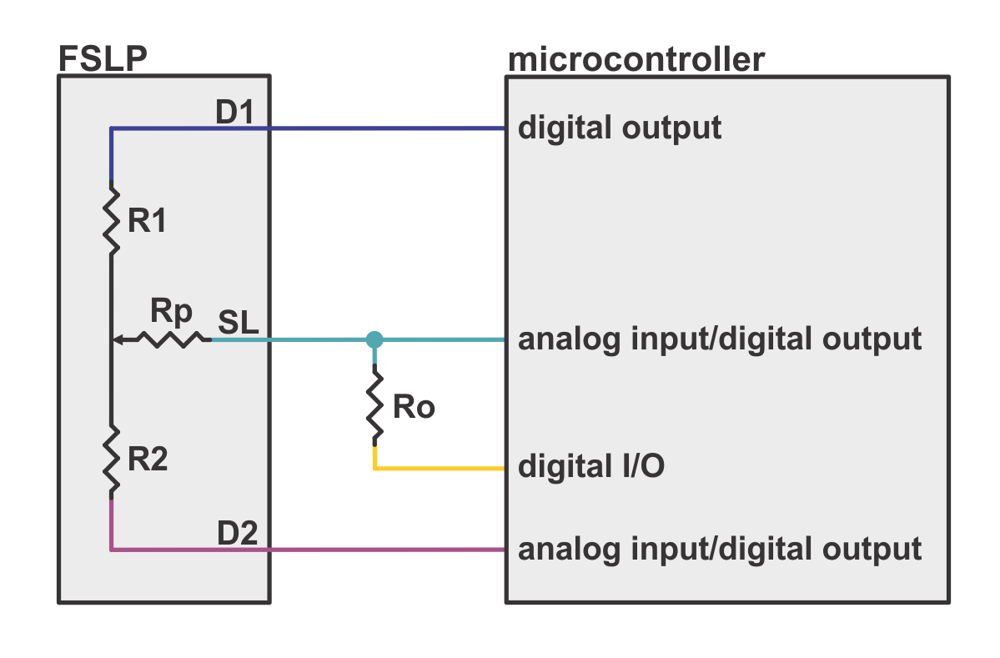
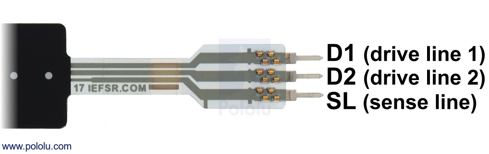

# FSLP-Sensor-Library
Arduino Library for abstracting position and force sampling from a force-sensing linear potentiometer with customizable low pass filter for sensor pressure and position and gain for pressure

Initialize a FSLP sensor class for each sensor as: 
~~~~
FSLP fslp(int fslpSenseLine, 
          int fslpDriveLine2, 
          int fslpDriveLine1, 
          int fslpBotR0,
          int Presgain,
          int filterTailTrim_Pres,
          int filterTailTrim_Pos);
int fslpSensor[2];                // Analog read storage array for fslp pressure and position
~~~~

- fslpSenseLine, fslpDriveLine2, fslpDriveLine1, fslpBotR0 correspond to the sensor and resistor input pins to the microcontroller respectively. See figures for reference
- Presgain varies sensor force/pressure sensitivity (gain needed varies by sensor and bias resistor) 
- filterTailTrim_Pres is proportional to the amount of sensor pressure filtering
- filterTailTrim_Pos is proportional to the amount of sensor position filtering

Class methods:
~~~~
fslp.GetPosition();               // returns integer position [0, 1023]
fslp.GetPressure(fslpSensor);     // stores filtered pressure in fslpSensor[0]
fslp.GetData(fslpSensor);         // stores filtered pressure in fslpSensor[0] and position in fslpSensor[1]
~~~~

